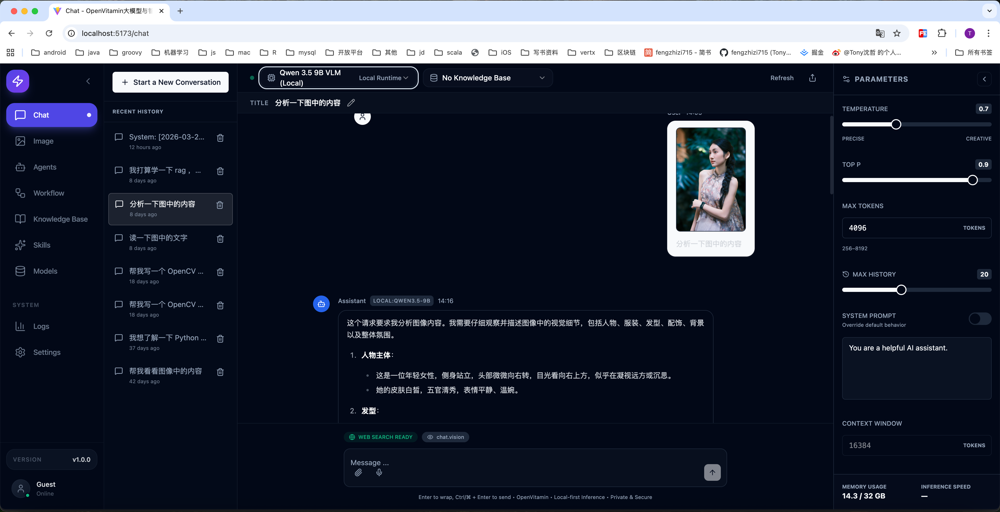
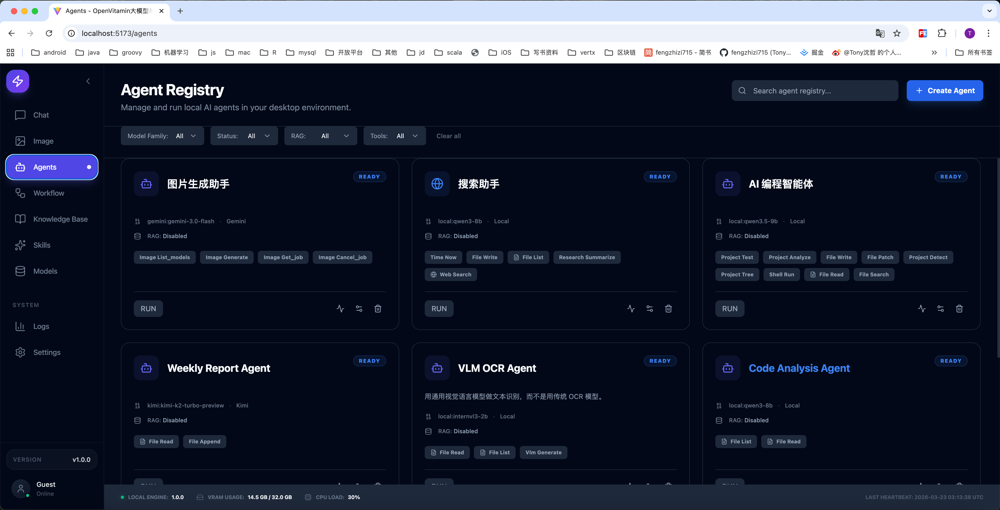
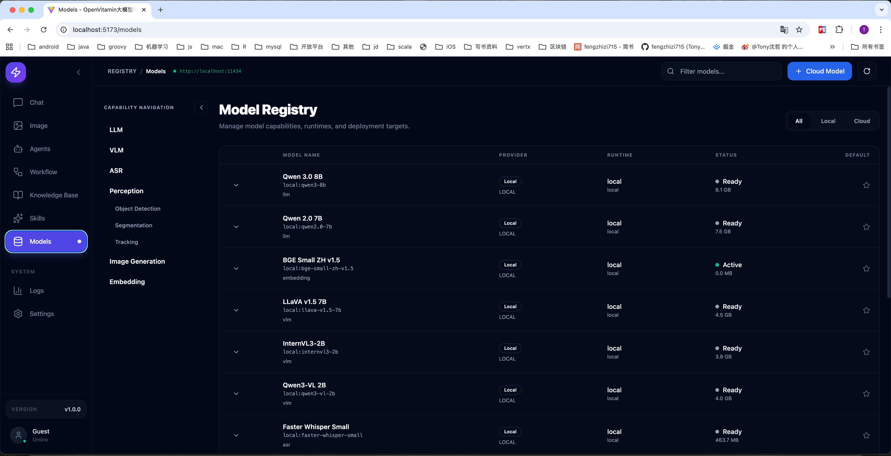
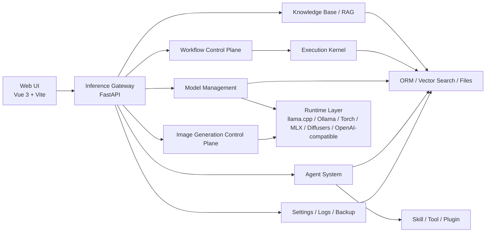
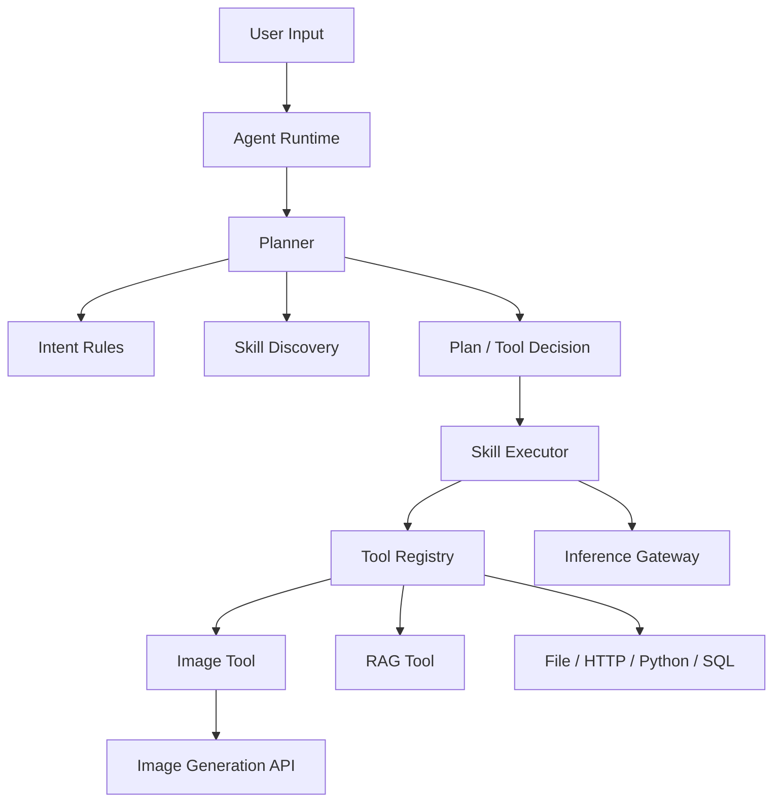
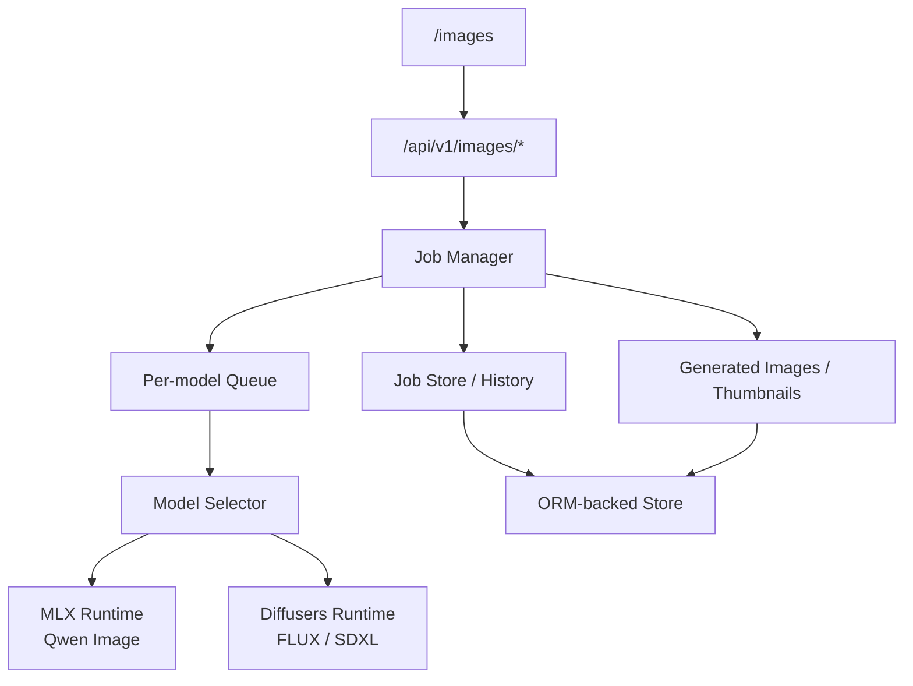

# OpenVitamin 大模型与智能体应用平台

> 本地优先的 AI 平台，统一承载模型推理、图片生成、工作流编排与智能体能力组合。

[English README](README_EN.md)

## 项目简介

**本地优先、隐私优先**：面向个人与团队的可私有部署推理平台，统一承载模型推理、工作流执行与智能体能力编排，强调可观测、可审计、可扩展。

**技术架构**：采用 **Vue 前端 + FastAPI 推理网关**。网关统一接入多种推理后端（如 Ollama、LM Studio、本地 GGUF、OpenAI 兼容 API 等），并支持与 OpenClaw 进行后端集成；前端不直连模型与工具，所有调用通过网关统一出口。

**分层角色**：
- **Web UI**：控制台，负责界面与交互
- **推理网关**：中枢，负责模型路由、请求编排与执行策略
- **Agent / Plugin**：能力模块，以插件形式扩展（Skill、Tool、RAG、记忆等）

## 亮点

- 统一推理网关，覆盖 `LLM`、`VLM`、`Embedding`、`ASR` 与 `Image Generation`
- 本地模型与云端模型统一纳入一个控制面管理
- 文生图工作台支持异步任务、历史记录、缩略图、warmup 与取消
- 智能体系统支持 `Intent Rules`、`Skill Discovery`、`Tool Calling` 与 `Direct Tool Result`
- Workflow Control Plane 支持版本化、执行历史与分支 / 循环治理
- 内置知识库、RAG、记忆、日志、设置与备份能力
- 支持 OpenClaw 后端集成，可作为统一模型入口接入现有 Agent 运行环境

## 截图









## 适用场景

- 统一管理本地模型与云端模型
- 搭建多模态聊天与视觉能力
- 用 Agent + Skill + Tool 组织能力
- 用 Workflow 编排多步 AI 流程
- 管理知识库、RAG 与长期记忆
- 运行本地文生图模型并管理生成任务
- 将 OpenClaw 作为上游模型后端接入统一推理网关

## 核心能力

- 统一推理 API：LLM / VLM / Embedding / ASR / Image Generation
- 多后端模型管理：本地与云端统一接入
- 多模态聊天：文本、图像、视觉感知
- 文生图工作台：异步任务、历史、缩略图、取消、warmup、详情页
- Agent 系统：Plan-Based 执行、Skill 语义发现、Intent Rules、Tool 调用
- Workflow Control Plane：版本化、执行记录、节点级状态、分支/循环治理
- 知识库与 RAG
- 备份与恢复：数据库备份、`model.json` 备份
- 系统设置、日志、监控与运行时治理

## 文生图支持

- `Qwen Image`：MLX 路径
- `FLUX / FLUX.2 / SDXL`：Diffusers 路径

当前文生图控制面已支持：
- `POST /api/v1/images/generate`
- job 查询 / 取消 / 删除
- 原图下载 / 缩略图
- warmup
- 历史记录与详情页

## 技术栈

**前端**
- Vue 3
- TypeScript
- Vite
- Tailwind CSS

**后端**
- Python 3.11+
- FastAPI
- SQLAlchemy / ORM 抽象（默认使用 SQLite，可扩展至 MySQL / PostgreSQL）

**运行时 / 模型侧**
- llama.cpp
- Ollama
- OpenAI-compatible API
- OpenClaw backend integration
- Torch
- MLX / mflux
- Diffusers

说明：
- 开源版本当前默认使用 SQLite
- 数据层按 ORM 抽象设计，后续可扩展到 MySQL / PostgreSQL 等关系型后端

## 系统架构

核心组件：
- Web UI：控制台
- Inference Gateway：统一推理入口
- Runtime Stabilization：模型实例、并发队列、资源治理
- Agent System：Planner / Skill / Tool / RAG
- Workflow Control Plane：定义、版本、执行、治理
- Image Generation Control Plane：图片任务、历史、文件落盘、warmup

详细设计见：
- [docs/architecture/ARCHITECTURE.md](docs/architecture/ARCHITECTURE.md)
- [docs/architecture/AGENT_ARCHITECTURE.md](docs/architecture/AGENT_ARCHITECTURE.md)

### 整体架构



### 推理路径


### 智能体执行路径



### 文生图控制面



## 快速开始

### 环境要求

- Python 3.11+
- Node.js 18+
- Conda

### 1. 创建并激活 Conda 环境

```bash
conda create -n ai-inference-platform python=3.11 -y
conda activate ai-inference-platform
```

### 2. 安装后端依赖

```bash
cd backend
pip install -r requirements.txt
cd ..
```

### 3. 安装前端依赖

```bash
cd frontend
npm install
cd ..
```

### 4. 启动服务

```bash
./run-all.sh
```

或分别启动：

```bash
./run-backend.sh
./run-frontend.sh
```

默认地址：
- 前端：[http://localhost:5173](http://localhost:5173)
- 后端：[http://localhost:8000](http://localhost:8000)

## 快速体验

建议按以下路径快速体验：

1. 打开 `/models`，确认模型已扫描或已接入云端模型
2. 打开 `/chat`，验证基础聊天或多模态聊天
3. 打开 `/images`，提交一次文生图任务
4. 打开 `/agents`，创建并运行一个工具型 Agent
5. 打开 `/workflow`，执行一个简单工作流

## 已验证环境

当前项目已在以下环境中验证可运行：
- macOS + Apple Silicon
- Ubuntu Linux
- Conda 管理 Python 环境
- 本地模型目录按 `model.json` 规范组织

运行说明：
- macOS + Apple Silicon 下，`MLX` 与 `MPS` / 本地大模型会共享统一内存
- Ubuntu 下可正常运行，文生图与推理路径更适合使用 `Torch / Diffusers` 等 Linux 常见运行时
- 同时加载大 LLM 与大文生图模型时，仍可能出现显存或内存压力
- 平台已实现图片模型切换时的资源回收，但仍建议根据机器资源选择合适模型规模

## 主要页面

- `/chat`：聊天与多模态对话
- `/images`：文生图工作台
- `/images/history`：图片任务历史
- `/agents`：智能体管理与运行
- `/workflow`：工作流列表、编辑、运行
- `/models`：模型管理
- `/knowledge`：知识库
- `/settings`：系统设置
- `/logs`：系统日志

## 项目结构

详细目录与架构说明见 `docs/`，这里仅保留后端高层概览。

后端目录概览：

```text
backend/                         # 后端服务根目录（FastAPI + 核心引擎）
├── api/                         # API 路由层（chat / vlm / asr / images / agents / workflows / system ...）
├── middleware/                  # 请求中间件（用户上下文、通用拦截）
├── core/                        # 核心业务层
│   ├── agent_runtime/           # Agent 运行时（legacy / plan_based）
│   ├── workflows/               # Workflow Control Plane
│   │   ├── models/              # Workflow / Version / Execution 领域模型
│   │   ├── repository/          # 工作流 ORM 仓储层
│   │   ├── services/            # 工作流应用服务
│   │   ├── runtime/             # 工作流运行时与图适配
│   │   └── governance/          # 并发、队列、配额治理
│   ├── inference/               # Inference Gateway
│   │   ├── client/              # 统一推理客户端入口
│   │   ├── gateway/             # 推理网关编排中枢
│   │   ├── router/              # 模型路由与选择
│   │   ├── providers/           # Provider 适配层
│   │   ├── registry/            # 模型别名与注册索引
│   │   ├── models/              # 推理请求 / 响应模型
│   │   ├── stats/               # 推理指标与统计
│   │   └── streaming/           # 流式输出抽象
│   ├── runtime/                 # Runtime Stabilization（实例管理 / 并发队列 / 运行指标）
│   ├── runtimes/                # 各推理后端运行时（llama.cpp / ollama / torch / mlx / diffusers / openai-compatible）
│   ├── models/                  # 模型扫描、注册、选择、Manifest 解析
│   ├── skills/                  # Skill 注册、发现、执行
│   ├── tools/                   # Tool 抽象与实现
│   ├── plugins/                 # 插件体系（builtin / rag / skills / tools）
│   ├── data/                    # ORM、DB 会话、向量检索抽象
│   ├── conversation/            # 会话历史与上下文管理
│   ├── memory/                  # 长期记忆模块
│   ├── knowledge/               # 知识库、切分、索引与状态管理
│   ├── rag/                     # RAG 检索与 trace 相关
│   ├── backup/                  # 数据库与 model.json 备份模块
│   ├── system/                  # 系统设置与运行参数
│   ├── plan_contract/           # Plan Contract 模型与校验
│   └── utils/                   # 核心层通用工具
├── execution_kernel/            # DAG 执行引擎
│   ├── engine/                  # 调度器、执行器、状态机
│   ├── models/                  # 图定义与运行时模型
│   ├── persistence/             # 图与执行状态持久化
│   ├── events/                  # 事件存储与事件类型
│   ├── replay/                  # 回放与状态重建
│   ├── optimization/            # 优化策略与快照
│   ├── analytics/               # 执行分析与效果统计
│   └── cache/                   # 节点级缓存
├── alembic/                     # 数据库迁移
├── config/                      # 配置定义（settings）
├── data/                        # 运行数据目录（platform.db、workspaces、backups、generated_images ...）
├── log/                         # 结构化日志模块
├── scripts/                     # 维护与运维脚本
├── tests/                       # 后端测试
└── utils/                       # 辅助工具
```

## 文档索引

建议按用途阅读：

**快速上手**
- [docs/DEPLOYMENT.md](docs/DEPLOYMENT.md)
- [docs/local_model/LOCAL_MODEL_DEPLOYMENT.md](docs/local_model/LOCAL_MODEL_DEPLOYMENT.md)
- [docs/api/API_DOCUMENTATION.md](docs/api/API_DOCUMENTATION.md)
- [docs/OPENCLAW_BACKEND_CONFIG.md](docs/OPENCLAW_BACKEND_CONFIG.md)

**架构设计**
- [docs/architecture/ARCHITECTURE.md](docs/architecture/ARCHITECTURE.md)
- [docs/architecture/AGENT_ARCHITECTURE.md](docs/architecture/AGENT_ARCHITECTURE.md)
- [docs/DEVELOPMENT_STATUS.md](docs/DEVELOPMENT_STATUS.md)

**开发参考**
- [AGENTS.md](AGENTS.md)
- [docs/DEVELOPMENT_GUIDE.md](docs/DEVELOPMENT_GUIDE.md)

## 已知限制

- Apple Silicon 上，本地大 LLM 与大文生图模型会争夺统一内存
- 图片模型首次加载和首次生成可能较慢
- 某些高级 Agent / Workflow 能力仍在持续演进中
- 不同本地模型的目录规范与运行时依赖并不完全相同，需要按 `model.json` 配置

## 联系方式
wechat：fengzhizi715

Email：fengzhizi715@126.com


## 贡献

欢迎提交 Issue 与 Pull Request。贡献方式、开发约束与提交建议见：

- [CONTRIBUTING.md](CONTRIBUTING.md)

## 许可证

本项目计划采用 **Apache License 2.0**。
