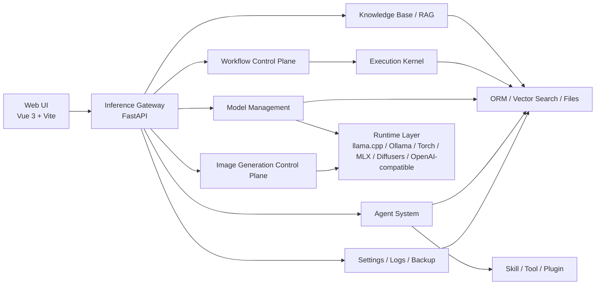
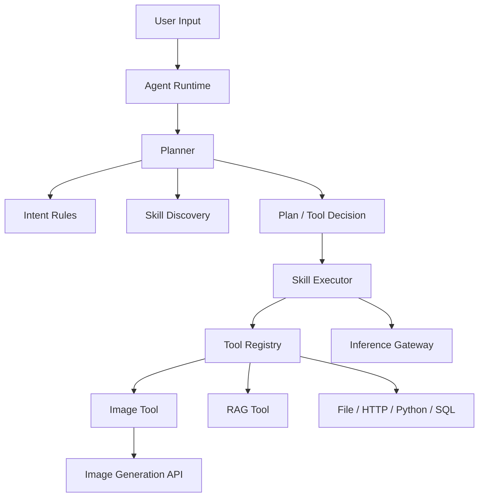
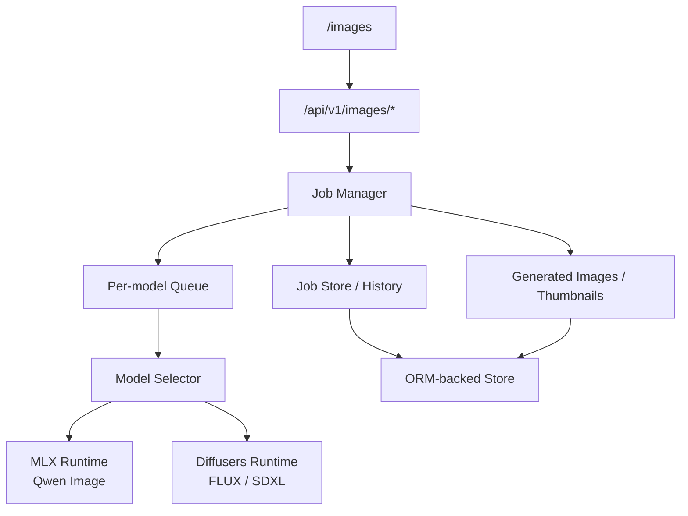

# OpenVitamin AI and Agent Platform

> A local-first AI platform for model inference, image generation, workflow orchestration, and agent-based capability composition.

## Project Overview

**Local-first, privacy-first**: OpenVitamin is a privately deployable inference platform for individuals and teams. It unifies model inference, workflow execution, and agent capability orchestration, with a strong focus on observability, auditability, and extensibility.

**Technical architecture**: the platform uses a **Vue frontend + FastAPI inference gateway**. The gateway integrates multiple inference backends such as Ollama, LM Studio, local GGUF runtimes, OpenAI-compatible APIs, and OpenClaw backend integration. The frontend does not connect directly to models or tools; all requests go through the gateway.

**Layered roles**:
- **Web UI**: console and interaction layer
- **Inference Gateway**: central control plane for routing, execution, and request orchestration
- **Agent / Plugin**: capability modules that extend the platform with Skills, Tools, RAG, memory, and workflows

## Highlights

- Unified inference gateway covering `LLM`, `VLM`, `Embedding`, `ASR`, and `Image Generation`
- One control plane for both local and cloud models
- Image generation workspace with async jobs, history, thumbnails, warmup, and cancellation
- Agent system with `Intent Rules`, `Skill Discovery`, `Tool Calling`, and `Direct Tool Result`
- Workflow Control Plane with versioning, execution history, and branch / loop governance
- Built-in support for knowledge base, RAG, memory, logs, settings, and backups
- OpenClaw backend integration for connecting existing agent/model environments through the unified gateway

## Screenshots


## Use Cases

- Manage local and cloud models in one place
- Build multimodal chat and vision capabilities
- Compose capabilities with Agent + Skill + Tool
- Orchestrate multi-step AI pipelines with Workflow
- Manage knowledge bases, RAG, and long-term memory
- Run local text-to-image models and manage generation jobs
- Connect OpenClaw as an upstream model backend behind the unified gateway

## Core Capabilities

- Unified inference APIs for `LLM / VLM / Embedding / ASR / Image Generation`
- Multi-backend model management across local and cloud runtimes
- Multimodal chat with text, image, and perception capabilities
- Image generation workspace with async jobs, history, thumbnails, cancellation, warmup, and detail pages
- Agent system with plan-based execution, skill discovery, intent rules, and tool calling
- Workflow Control Plane with versioning, execution records, node-level state, and branch / loop governance
- Knowledge base and RAG support
- Backup and recovery for database state and `model.json`
- System settings, logs, monitoring, and runtime governance

## Image Generation Support

- `Qwen Image`: MLX path
- `FLUX / FLUX.2 / SDXL`: Diffusers path

The image generation control plane currently supports:
- `POST /api/v1/images/generate`
- job query / cancellation / deletion
- original file download / thumbnail download
- warmup
- history and detail pages

## Tech Stack

**Frontend**
- Vue 3
- TypeScript
- Vite
- Tailwind CSS

**Backend**
- Python 3.11+
- FastAPI
- SQLAlchemy / ORM abstraction (SQLite by default, extensible to MySQL / PostgreSQL)

**Runtime and model backends**
- llama.cpp
- Ollama
- OpenAI-compatible API
- OpenClaw backend integration
- Torch
- MLX / mflux
- Diffusers

Notes:
- The open-source edition currently uses SQLite by default
- The data layer is designed around ORM abstractions and can be extended to MySQL / PostgreSQL later

## Architecture

Core components:
- Web UI: console
- Inference Gateway: unified inference entrypoint
- Runtime Stabilization: model instances, concurrency queues, and resource governance
- Agent System: Planner / Skill / Tool / RAG
- Workflow Control Plane: definition, versioning, execution, and governance
- Image Generation Control Plane: image jobs, history, file persistence, and warmup

Detailed design:
- [docs/architecture/ARCHITECTURE.md](docs/architecture/ARCHITECTURE.md)
- [docs/architecture/AGENT_ARCHITECTURE.md](docs/architecture/AGENT_ARCHITECTURE.md)

### Overall Architecture



### Inference Path


### Agent Execution Path



### Image Generation Control Plane



## Quick Start

### Requirements

- Python 3.11+
- Node.js 18+
- Conda

### 1. Create and activate the Conda environment

```bash
conda create -n ai-inference-platform python=3.11 -y
conda activate ai-inference-platform
```

### 2. Install backend dependencies

```bash
cd backend
pip install -r requirements.txt
cd ..
```

### 3. Install frontend dependencies

```bash
cd frontend
npm install
cd ..
```

### 4. Start the services

```bash
./run-all.sh
```

Or start them separately:

```bash
./run-backend.sh
./run-frontend.sh
```

Default URLs:
- Frontend: [http://localhost:5173](http://localhost:5173)
- Backend: [http://localhost:8000](http://localhost:8000)

## Quick Demo

Recommended first-run path:

1. Open `/models` and verify that local or cloud models are available
2. Open `/chat` and test basic or multimodal chat
3. Open `/images` and submit one image generation job
4. Open `/agents` and run a tool-oriented agent
5. Open `/workflow` and execute a simple workflow

## Verified Environments

The project has been verified in the following environments:
- macOS + Apple Silicon
- Ubuntu Linux
- Conda-managed Python environment
- Local model directories organized with `model.json`

Runtime notes:
- On macOS + Apple Silicon, `MLX`, `MPS`, and large local models share unified memory
- On Ubuntu, the platform runs normally and image generation is better aligned with common Linux runtimes such as `Torch / Diffusers`
- Running large LLMs and large image generation models at the same time may still cause memory pressure
- The platform releases resources when switching image models, but model size should still match available hardware

## Main Pages

- `/chat`: chat and multimodal conversation
- `/images`: image generation workspace
- `/images/history`: image generation history
- `/agents`: agent management and execution
- `/workflow`: workflow list, editor, and execution
- `/models`: model management
- `/knowledge`: knowledge base
- `/settings`: system settings
- `/logs`: system logs

## Project Structure

Detailed directory and architecture descriptions are available under `docs/`. This section only keeps a high-level backend overview.

```text
backend/                         # Backend service root (FastAPI + core engine)
├── api/                         # API routes (chat / vlm / asr / images / agents / workflows / system ...)
├── middleware/                  # Request middleware (user context, common interception)
├── core/                        # Core business layer
│   ├── agent_runtime/           # Agent runtime (legacy / plan_based)
│   ├── workflows/               # Workflow Control Plane
│   │   ├── models/              # Workflow / Version / Execution domain models
│   │   ├── repository/          # Workflow ORM repository layer
│   │   ├── services/            # Workflow application services
│   │   ├── runtime/             # Workflow runtime and graph adaptation
│   │   └── governance/          # Concurrency, queue, and quota governance
│   ├── inference/               # Inference Gateway
│   │   ├── client/              # Unified inference client entrypoint
│   │   ├── gateway/             # Gateway orchestration core
│   │   ├── router/              # Model routing and selection
│   │   ├── providers/           # Provider adapter layer
│   │   ├── registry/            # Model alias and registration index
│   │   ├── models/              # Inference request / response models
│   │   ├── stats/               # Inference metrics and stats
│   │   └── streaming/           # Streaming abstractions
│   ├── runtime/                 # Runtime Stabilization (instance management / queues / runtime metrics)
│   ├── runtimes/                # Provider runtimes (llama.cpp / ollama / torch / mlx / diffusers / openai-compatible)
│   ├── models/                  # Model scanning, registration, selection, manifest parsing
│   ├── skills/                  # Skill registration, discovery, execution
│   ├── tools/                   # Tool abstractions and implementations
│   ├── plugins/                 # Plugin system (builtin / rag / skills / tools)
│   ├── data/                    # ORM, DB sessions, vector search abstractions
│   ├── conversation/            # Conversation history and context management
│   ├── memory/                  # Long-term memory modules
│   ├── knowledge/               # Knowledge base, chunking, indexing, and state management
│   ├── rag/                     # RAG retrieval and trace-related modules
│   ├── backup/                  # Database and model.json backup modules
│   ├── system/                  # System settings and runtime parameters
│   ├── plan_contract/           # Plan Contract models and validation
│   └── utils/                   # Core-layer shared utilities
├── execution_kernel/            # DAG execution engine
│   ├── engine/                  # Scheduler, executor, state machine
│   ├── models/                  # Graph definitions and runtime models
│   ├── persistence/             # Graph and execution state persistence
│   ├── events/                  # Event storage and event types
│   ├── replay/                  # Replay and state rebuilding
│   ├── optimization/            # Optimization strategies and snapshots
│   ├── analytics/               # Execution analytics and impact statistics
│   └── cache/                   # Node-level cache
├── alembic/                     # Database migrations
├── config/                      # Configuration definitions (settings)
├── data/                        # Runtime data (platform.db, workspaces, backups, generated_images ...)
├── log/                         # Structured logging module
├── scripts/                     # Maintenance and operations scripts
├── tests/                       # Backend tests
└── utils/                       # Utility helpers
```

## Documentation Index

Recommended reading by purpose:

**Quick Start**
- [docs/DEPLOYMENT.md](docs/DEPLOYMENT.md)
- [docs/local_model/LOCAL_MODEL_DEPLOYMENT.md](docs/local_model/LOCAL_MODEL_DEPLOYMENT.md)
- [docs/api/API_DOCUMENTATION.md](docs/api/API_DOCUMENTATION.md)
- [docs/OPENCLAW_BACKEND_CONFIG.md](docs/OPENCLAW_BACKEND_CONFIG.md)

**Architecture**
- [docs/architecture/ARCHITECTURE.md](docs/architecture/ARCHITECTURE.md)
- [docs/architecture/AGENT_ARCHITECTURE.md](docs/architecture/AGENT_ARCHITECTURE.md)
- [docs/DEVELOPMENT_STATUS.md](docs/DEVELOPMENT_STATUS.md)

**Development Reference**
- [AGENTS.md](AGENTS.md)
- [docs/DEVELOPMENT_GUIDE.md](docs/DEVELOPMENT_GUIDE.md)

## Known Limitations

- On Apple Silicon, large local LLMs and large image generation models compete for unified memory
- Initial image model loading and first-generation latency can be high
- Some advanced Agent / Workflow capabilities are still evolving
- Local model directory conventions and runtime dependencies are not fully uniform and still rely on `model.json`

## Contact information
wechat：fengzhizi715

Email：fengzhizi715@126.com

<div style="display: flex; justify-content: space-between;">
    
    
</div>

## Contributing

Issues and Pull Requests are welcome. For contribution guidelines, development constraints, and submission expectations, see:

- [CONTRIBUTING.md](CONTRIBUTING.md)

## License

The project is planned to use **Apache License 2.0**.
